# LAB 1
#### Student name: Nguyễn Huỳnh Quốc Bảo
#### Student ID: 22110010
## Bof1
### Here we have the source code of bof1
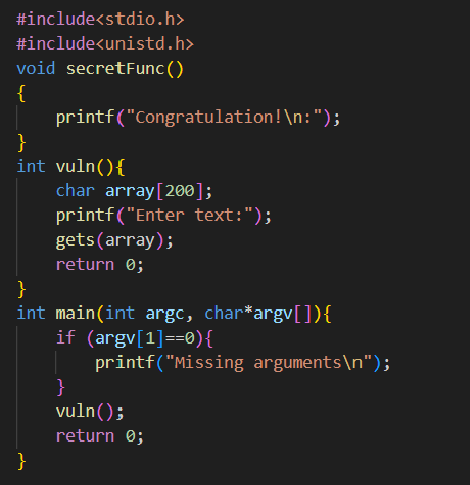
### Stack frame in bof1
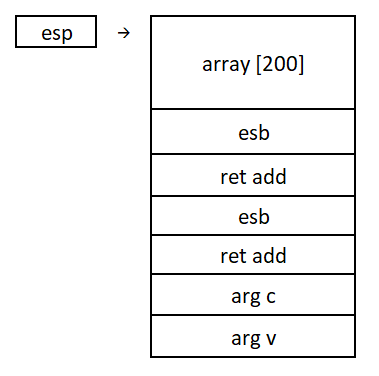
### Ways to do bof1
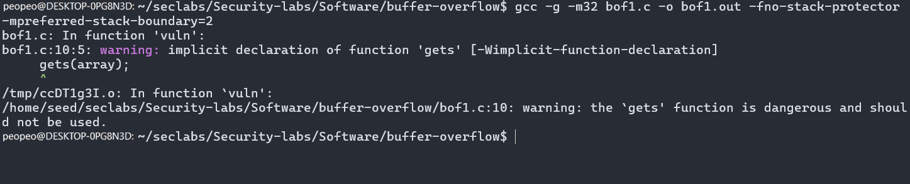
#### Create bof1.out file
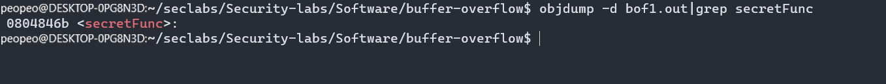
#### Get the address of the secretFunc()
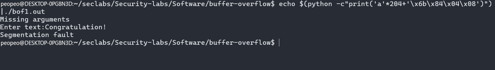
#### Use the address we in the secretFunc() to change the address of vuln() function to secretFunc() and we complete bof1
## Bof2
### Here we have the source code of bof2
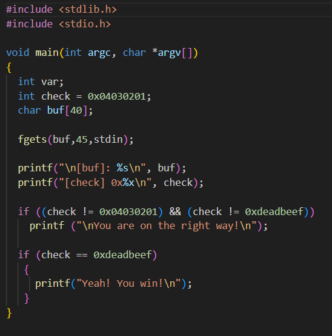
### Stack frame in bof2
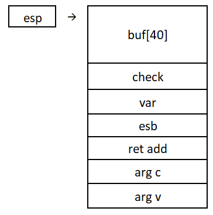
### Ways to do bof2
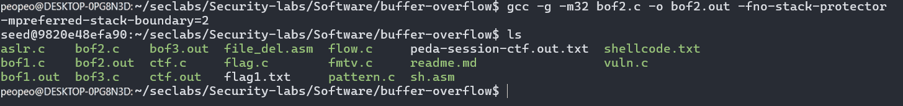
#### Create bof2.out file
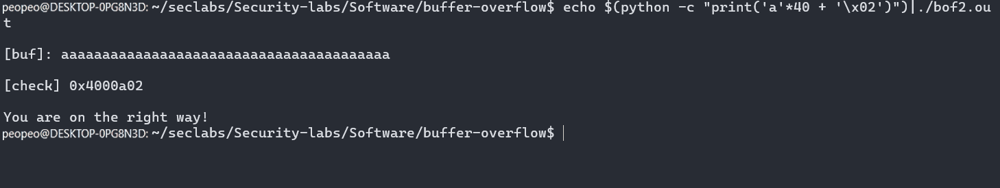
#### When we change '/x02' to '\xef\xbe\xad\xde' the output will changetp "Yeah! You win!"
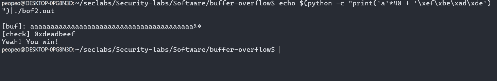
## Bof3
### Here we have the source code of bof3
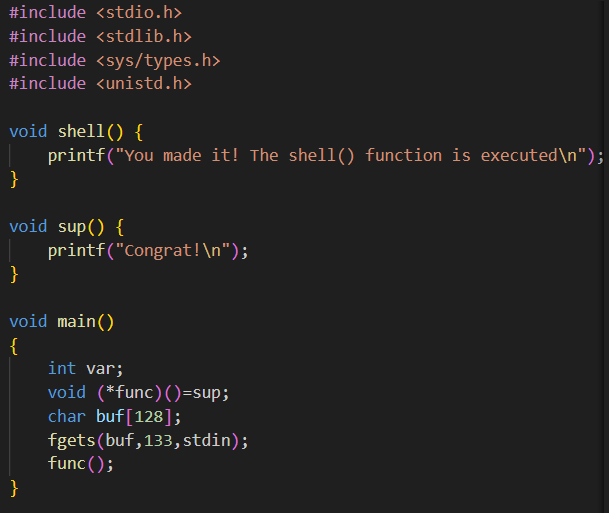
### Stack frame in bof3
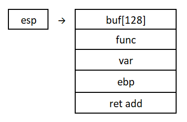
### Ways to do bof3
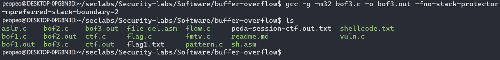
#### Create bof3.out file
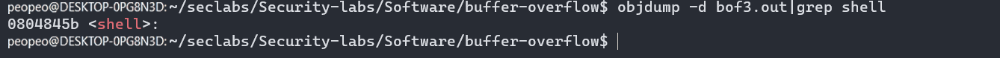
#### Use objdump to get address of shell function and change the func funtion to shell
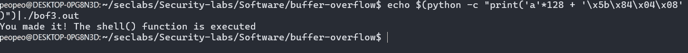