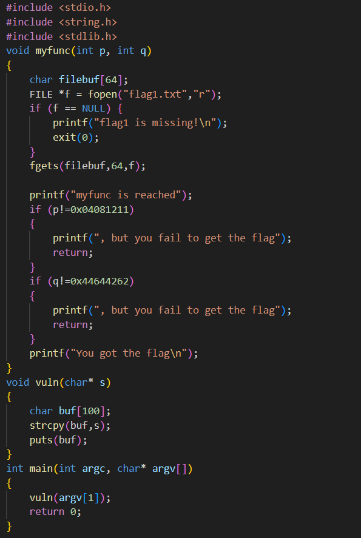
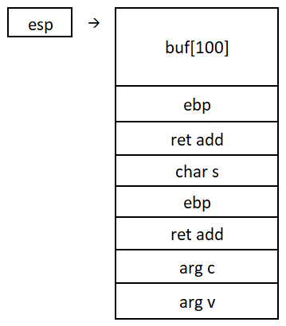
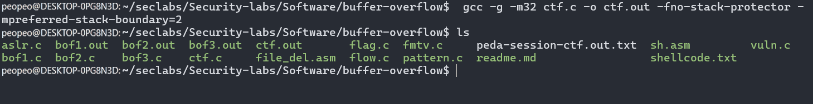
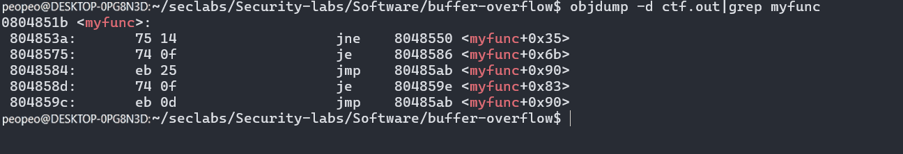
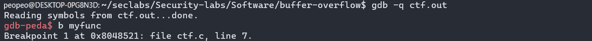
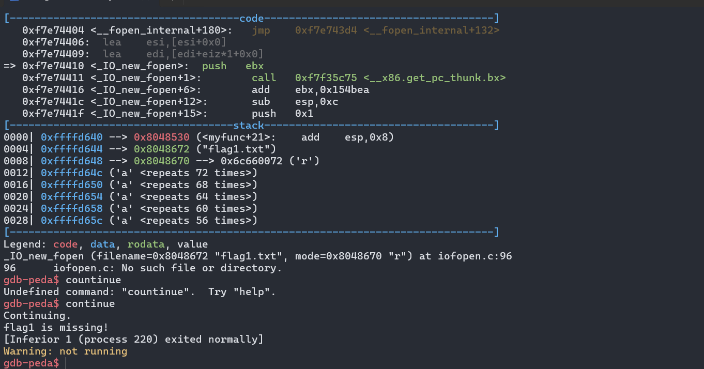
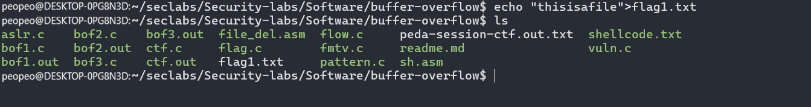
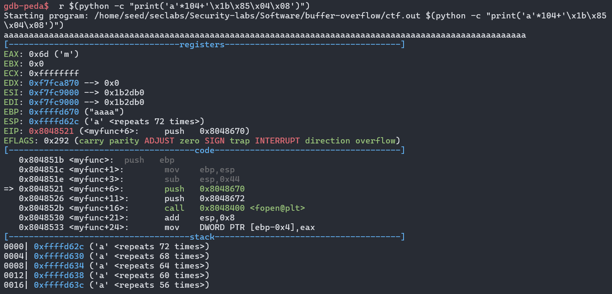
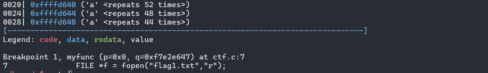
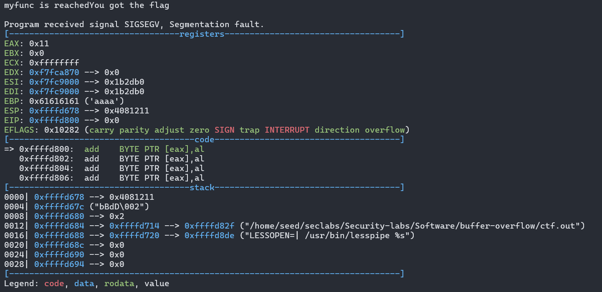

# LAB 2
#### Student name: Nguyễn Huỳnh Quốc Bảo
#### Student ID: 22110010
## ctf
### Here we have the source code of ctf

### Stack frame in ctf

### Ways to do ctf

#### Create ctf.out file

#### Now we use objdump to get address of myfunc function. After that, we use gdb and make a breakpoint

#### The code shows that within the function myfunc, there's a check for the file flag1.txt. If we attempt to overwrite it at this point, the following will occur

#### If we want to advoid it, we must create flag1.txt file

#### Use r echo to modify the return address of vul and redirecting it

#### Now we will need to set p and q value 
